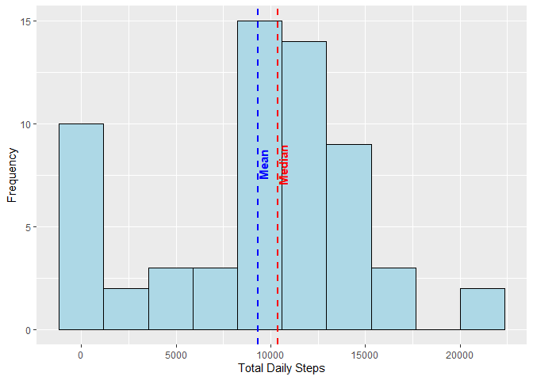
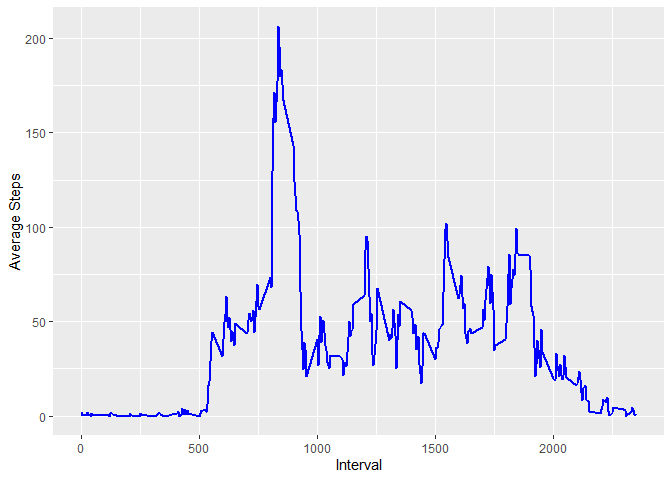
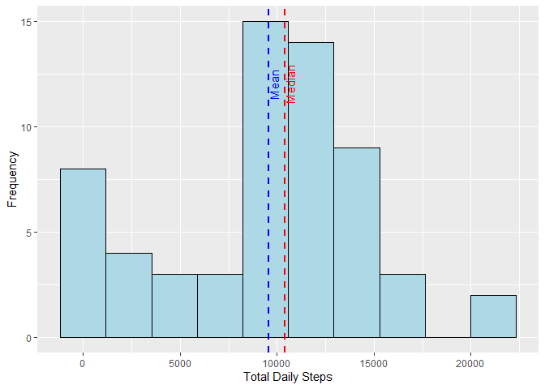
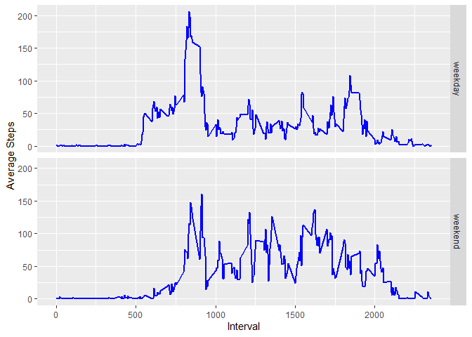

## Loading and preprocessing the data

We will read in the file "activity.csv" and convert the "date" field to dates.


```r
data <- read.csv("activity.csv")
data$date = as.Date(as.character(data$date), "%Y-%m-%d")
```

## What is mean total number of steps taken per day?

We will group the dataset by the "date" field and calculate the sum of the "steps" for each date.


```r
daily <- data %>%
    group_by(date) %>%
    summarise(totalsteps = sum(steps, na.rm = TRUE), 
              .groups = 'drop') %>%
    as.data.frame()

meansteps <- mean(daily$totalsteps, na.rm = TRUE)

medsteps <- median(daily$totalsteps, na.rm = TRUE)

ggplot(daily, aes(x = totalsteps)) +
    geom_histogram(bins = 10, color = "black", fill = 'lightblue') +
    labs(x = "Total Daily Steps",
         y = "Frequency") +
    geom_vline(xintercept = c(meansteps, medsteps),
             linetype = "dashed",
             color = c("blue", "red"),
             size = 1) +
    annotate(geom = "text",
             label = c("Mean", "Median"),
             x = c(meansteps, medsteps),
             y = c(8, 8),
             color = c("blue", "red"),
             fontface = "bold",
             angle = 90,
             vjust = 1)
```

<!-- -->

The mean daily steps is **9354.2295082** and the median is **10395**.

## What is the average daily activity pattern?

We will group the dataset by the "interval" and calculate the mean of the "steps" for each "interval".


```r
intervals <- data %>%
    group_by(interval) %>%
    summarise(meansteps = mean(steps, na.rm = TRUE), 
              .groups = 'drop') %>%
    as.data.frame()

maxintsteps <- max(intervals$meansteps)

maxint <- intervals[intervals$meansteps == maxintsteps, 1]

ggplot(intervals, aes(x = interval, y = meansteps)) +
    geom_line(size = 1,
              color = "blue") +
    labs(x = "Interval",
         y = "Average Steps")
```

<!-- -->

On average, the most steps take place during interval **835** with **206.1698113** steps.

## Imputing missing values

```r
missingvals <- format(sum(is.na(data$steps)), big.mark = ",")
pctmissing <- mean(is.na(data$steps)) * 100
```

The original dataset had **2,304** (or **13.1147541%**) missing values for "steps".

To impute the missing values, we will:  
1. Break the data into "weekends" and "weekdays"  
2. Calculate the median for each interval, grouping by "weekends" and "weekdays"  
3. Replace the NAs with the newly imputed value  
4. Place the results in a new data frame called "data2"


```r
data$weekend <- ifelse(weekdays(data$date) == "Saturday" | weekdays(data$date) == "Sunday",
                       "weekend",
                       "weekday")

data$weekend <- as.factor(data$weekend)

intbywkday <- data %>%
    group_by(weekend, interval) %>%
    summarise(medsteps = median(steps, na.rm = TRUE), 
              .groups = 'drop') %>%
    as.data.frame()

data2 <- data %>%
    inner_join(intbywkday, by = c("weekend", "interval"))

data2$steps[is.na(data2$steps)] <- data2$medsteps

daily2 <- data2 %>%
    group_by(date) %>%
    summarise(totalsteps = sum(steps, na.rm = TRUE), 
              .groups = 'drop') %>%
    as.data.frame()

meansteps2 <- mean(daily2$totalsteps, na.rm = TRUE)

medsteps2 <- median(daily2$totalsteps, na.rm = TRUE)


ggplot(daily2, aes(x = totalsteps)) +
    geom_histogram(bins = 10, color = "black", fill = 'lightblue') +
    labs(x = "Total Daily Steps",
         y = "Frequency") +
    geom_vline(xintercept = c(meansteps2, medsteps2),
               linetype = "dashed",
               color = c("blue", "red"),
               size = 1) +
    annotate(geom = "text",
             label = c("Mean", "Median"),
             x = c(meansteps2, medsteps2),
             y = c(12, 12),
             color = c("blue", "red"),
             angle = 90,
             vjust = 1)
```

<!-- -->

```r
diffmeansteps <- meansteps2 - meansteps

fmedsteps2 <- format(medsteps2, big.mark = ",")
```

The new mean daily steps is **9547.0491803** and the median is **10,395**. The mean daily steps increased by **192.8196721**, while the median stayed the same.

## Are there differences in activity patterns between weekdays and weekends?

Using the new dataset created with the imputed values and the field for "weekend", we can compare the average steps by interval between weekends and weekdays.


```r
intervals2 <- data2 %>%
    group_by(weekend, interval) %>%
    summarise(meansteps = mean(steps, na.rm = TRUE), 
              .groups = 'drop') %>%
    as.data.frame()

ggplot(intervals2, aes(x = interval, y = meansteps)) +
    geom_line(size = 1,
              color = "blue") +
    facet_grid(rows = vars(weekend)) +
    labs(x = "Interval",
         y = "Average Steps")
```

<!-- -->
